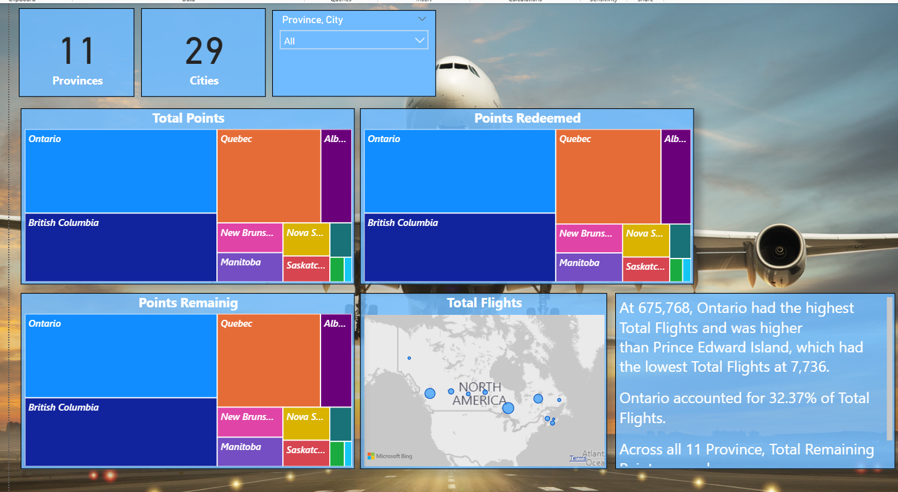

### **Airline Loyalty Program Analysis**

This project was accomplished using Microsoft PowerBI. 

The original data can be found in the **data** folder

Steps taken with PowerBI;
- Data loading and transformation using PowerQuery
    - Changing data types of several columns
    - Replaced values in the Month column; changing numerical representation to string representation, 7 to "July".
- Creation of data tables to initially understand the dataset. This established the foundation for creating the data visuals as seen below.
- Creation of calculated measures, using the **DIVIDE**, **CALCULATE** and **SUM** functions such as;
    - %_accumulated_points_July: 
    ```
    %_accumulated_points_July = 
    DIVIDE(
    CALCULATE(
        SUM(customer_flight_activity[Points Accumulated]),
        'customer_flight_activity'[Month] = "July"
    ),
    [total_points],
    0
    ) * 100 
    ```
- Creation of calculated Date table based on Months using the **DATATABLE** function;
    - Datetable:
    ```
    DateTable = DATATABLE(
    "Month",STRING,{
        {"January"},
        {"Feburary"},
        {"March"},
        {"April"},
        {"May"},
        {"June"},
        {"July"},
        {"August"},
        {"September"},
        {"October"},
        {"November"},
        {"December"}
    }
    )
    ```
- Creation of model relationships;
    - One to many relationship between; customer_loyalty_history with customer_flight_activity, using the **LOYALTY NUMBER** column.
    - One to many relationship between; customer_flight_activity with DateTable, using the **MONTH** column.
- Plotting of visuals which were uniform and easy on the eyes and straightforward for viewing by the audience.
- Drawing observations and conclusions from visualisations.

Please kindly check **airline_final.pbix** for the powerbi file in the powerbi_analysis folder.

### **Some images from PowerBI**

 
 


### **Conclusion**
- From the observations as shown within the visuals, it would seem that the 2018 promotions played a major factor with the increased number of customers in the year 2018.